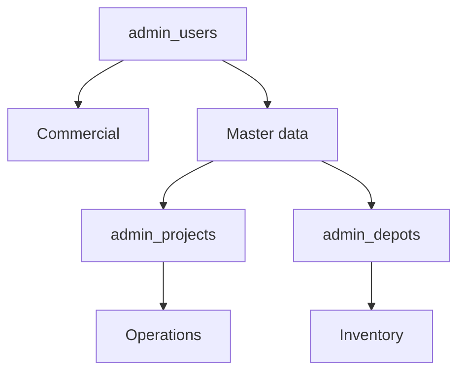

# Database schema (Supabase SQL)

Greenfield install — run these files **in order** on an empty Supabase project.

| Order | File | Domain |
|------|------|--------|
| 1 | `00-foundation.sql` | `admin_users`, `admin_customers`, `touch_updated_at()` |
| 2 | `01-commercial.sql` | Product categories, products, quotes, templates, suppliers |
| 3 | `02-master-data.sql` | Projects, depots, equipment, employees |
| — | **Patches (existing DB)** | See [Apply patches](#apply-patches-existing-database) below |
| 3b | `06-project-detail-fields.sql` | Extra project columns |
| 3c | `07-fuel-da-fields.sql` | DA Gasoil columns on purchase requests |
| 3d | `08-gasoil-bons.sql` | Bons gasoil achat/sortie |
| 3e | `09-commercial-quote-document-type.sql` | `document_type` on quotes (devis / BC / facture) |
| 4 | `03-inventory.sql` | Stock items, stock movements |
| 5 | `04-operations.sql` | Fuel, production, drilling, HR, parts, trips, DA, rentals |

**Source of truth for chantiers:** `admin_projects` (there is no `admin_sites` table).

## Architecture



- **Commercial** — customers, catalog, quotes (client-facing).
- **Master data** — projects (chantiers), depots, equipment, employees (shared registry).
- **Operations** — transactional rows; almost all link to `project_id` for P&L and project hub KPIs.
- **Inventory** — stock rolls up to `depot_id`; optional `project_id` when issuing to a chantier.

## Key relationships

| Child table | Parent FK | ON DELETE |
|-------------|-----------|-----------|
| All business tables | `admin_users` | CASCADE |
| `admin_depots` | `admin_projects` (optional) | SET NULL |
| `admin_employees` | `default_project_id` → `admin_projects` | SET NULL |
| `admin_stock_items` | `default_depot_id` → `admin_depots` | SET NULL |
| `admin_stock_movements` | `item_id`, `depot_id`, `project_id` | SET NULL |
| `admin_fuel_entries` | `project_id`, `equipment_id` | SET NULL |
| `admin_production_entries` | `project_id` | SET NULL |
| `admin_drilling_reports` | `project_id` | SET NULL |
| `admin_attendance` | `project_id`, `employee_id` | SET NULL |
| `admin_parts_usage` | `project_id`, `equipment_id`, `stock_item_id` | SET NULL |
| `admin_trips` | `project_id` | SET NULL |
| `admin_purchase_requests` | `project_id` | SET NULL |
| `admin_rental_contracts` | `project_id` | SET NULL |

**Not linked (by design):** commercial quotes/products have no `project_id` yet; customers are independent of chantiers.

Cached text columns (`site_name`, `equipment_name`, …) are denormalized labels for exports — set from FK parents on write; report by `project_id`, not by name alone.

## Apply patches (existing database)

If the app was already deployed before carburant / facturation updates, run incremental SQL (safe to re-run):

```bash
node scripts/run-patches-pg.mjs
```

Or paste into Supabase **SQL Editor** (in order): `06` → `07` → … → `18` (bon location `bon_lines`), `19` (gasoil contacts).

**Factures / devis / bons de commande** — no separate table. Each row in `admin_quotes` stores the full document in `payload` (jsonb), including `documentType`, `dueDate`, lines, etc. Patch `09` adds a generated `document_type` column for faster filtering.

## After SQL

1. Sign in to admin (app upserts your row in `admin_users`).
2. Create a project → depot → equipment → employee.
3. Log fuel / production with a project selected.
4. Open `/admin/projets/[id]` — KPIs should populate.

## Legacy files (do not run)

These are superseded by `00`–`04` above:

- `admin-operations-schema.sql`
- `admin-devis-schema.sql`
- `admin-product-categories.sql`
- `admin-projects-depots-schema.sql`
